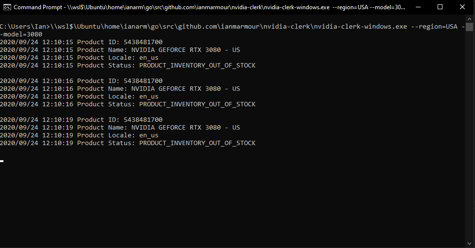

# UPDATE

Nvidia is sadly no longer selling their GPUs on their own store, for the foreseeable future all Founders Edition cards will be sold via 3rd party retailers (I believe only in North America) as such this project is deprecated. I thank everybody for all their support and feedback throughout the process of writing and maintaining Clerk. I'm going to be deprecating this project but will leave the code up as a historical reference for the future in case NVIDIA starts to sell cards again using their same digital storefront.


## Shield Badges
 [](https://coveralls.io/github/ianmarmour/nvidia-clerk?branch=master) [](https://discord.gg/gTgJRz7) 
# nvidia-clerk

`nvidia-clerk` is a command-line tool written to help you get an RTX 30XX or RTX 20XX series GPU.


## Known Issues
### NVIDIA API
If you have this message or similar please don't make an issue. `"https://api-prod.nvidia.com/direct-sales-shop/DR/products/en_us/USD/5438481700": context deadline exceeded (Client.Timeout exceeded while awaiting headers)`

## Discord Server
To hear about any widespread issues or new releases of this tool join the Discord by clicking the [chat button](https://github.com/ianmarmour/nvidia-clerk/blob/master/README.md#shield-badges) above.

## Background
`nvidia-clerk` was written in response to the recent NVIDIA RTX 3080 release debacle. During the launch, multiple different groups of scalpers used
private bots to procure large quantities of NVIDIA GPU's and most consumers were left without being able to purchase the product. This project will provide a short term solution so that customers can ensure they can buy a GPU and compete with these scalpers.

NVIDIA Clerk doesn't purchase products for customers, it simply tracks the available inventory from NVIDIAs APIs when a card becomes available it can automatically notify you or open your browser to the page with a cart containing your item.

## Install

### Download
Download your correct os file from **[LATEST RELEASE.](https://github.com/ianmarmour/nvidia-clerk/releases/latest)** [What is ARM?](https://en.wikipedia.org/wiki/ARM_architecture)
| :exclamation:  Make sure you accept any browser warnings, these warnings are because these release binaries are not "signed" (this costs money and as a free project we haven't paid for a signing certificate)   |
|-----------------------------------------|

### Supported Region Codes

AUT, BEL, CAN, CZE, DNK, FIN, FRA, DEU, USA, GBR, IRL, ITA, SWE, LUX, POL, PRT, ESP, NOR, NLD

### Supported Models By Region

`-model=2060` NVIDIA RTX 2060 SUPER - All-Region Codes Except PRT

`-model=2070` NVIDIA RTX 2070 SUPER - All-Region Codes Except PRT

`-model=2080` NVIDIA RTX 2080 SUPER - All-Region Codes Except CAN, PRT

`-model=2080TI` NVIDIA RTX 2080 TI - All-Region Codes Except FRA, PRT

`-model=3080` NVIDIA RTX 3080 - All-Region Codes

`-model=3090` NVIDIA RTX 3090 - All-Region Codes Except PRT

## Usage

### Windows - Command Prompt
| :memo:        | All commands should be executed inside of cmd.exe |
|---------------|:------------------------|
```Batchfile
nvidia-clerk-windows.exe -region=REGION_CODE_HERE -model=3080
```

### Windows - Powershell
| :memo:        | All commands should be executed inside of powershell.exe |
|---------------|:------------------------|
```Batchfile
.\nvidia-clerk-windows.exe -region=REGION_CODE_HERE -model=3080
```

### Mac OSX
| :memo:        | All commands should be executed inside of Terminal.app |
|---------------|:------------------------|
```shell
chmod +x ./nvidia-clerk-darwin

./nvidia-clerk-darwin -region=REGION_CODE_HERE -model=3080
```

### Linux
| :memo:        | All commands should be executed inside of Shell |
|---------------|:------------------------|
```shell
chmod +x ./nvidia-clerk-linux

./nvidia-clerk-linux -region=REGION_CODE_HERE -model=3080
```

## Testing

Testing is currently only supported in regions with the 2060 but it should show you what the automated checkout will look like.

### Windows
| :memo:        | All commands should be executed inside of cmd.exe |
|---------------|:------------------------|
```Batchfile
nvidia-clerk-windows.exe -region=USA -model=2060
```

### Mac OSX
| :memo:        | All commands should be executed inside of Terminal.app |
|---------------|:------------------------|
```shell
./nvidia-clerk-darwin -region=USA -model=2060
```

### Linux
| :memo:        | All commands should be executed inside of Shell |
|---------------|:------------------------|
```shell
./nvidia-clerk-linux -region=USA -model=2060
```


# Advanced Usage

## Desktop Notifications
Can be used in conjunction with sms/telegram/etc adds popup notifications on your desktop with sound/visual indicator.
```
nvidia-clerk-windows.exe -model=3080 -desktop
```

## Remote Mode
Disables browser automation and instead sends you the checkout link via one of the below notification services you can click the link on any device to get to your checkout with the card added. This is great for people who can't be at their computer during the day! (Try testing with -model=2060 to see how this new feature works)
```
nvidia-clerk-windows.exe -model=3080 -sms -remote
```

## Manual Delay Usage
Example of setting a 1 second delay (delay is specificed in miliseconds)
```Batch
nvidia-clerk-windows.exe -region=USA  -model=3080 -delay=1000
```

## SMS Notifications
| :exclamation:  Android users must disable the link preview feature in their messaging app of choice!!!!   |
|-----------------------------------------|

### Configuration
```Batchfile
set TWILIO_ACCOUNT_SID=YOUR_TWILIO_ACCOUNT_SID_HERE
set TWILIO_TOKEN=YOUR_TWILIO_TOKEN_HERE
set TWILIO_SOURCE_NUMBER=YOUR_TWILIO_SERVICE_NUMBER_HERE
set TWILIO_DESTINATION_NUMBER=YOUR_DESITNATION_NUMBER_FOR_NOTIFICATIONS_HERE
```

### Testing
Testing only works fully with an in-stock card.
```shell
nvidia-clerk-windows.exe -sms -model=2060
```

### Usage

```shell
nvidia-clerk-windows.exe -sms -region=REGION_CODE_HERE -model=3080
```

## Discord Notifications

### Configuration
```Batchfile
set DISCORD_WEBHOOK_URL=DISCORD_WEBHOOK_URL_HERE
```

### Testing
```Batchfile
./nvidia-clerk-windows.exe -discord -model=2060
```

### Usage

```Batchfile
./nvidia-clerk-windows.exe -discord -region=REGION_CODE_HERE -model=3080
```

## Twitter Notifications

### Configuration
```Batchfile
set TWITTER_CONSUMER_KEY=YOUR_TWITTER_CONSUMER_KEY_HERE
set TWITTER_CONSUMER_SECRET=YOUR_TWITTER_CONSUMER_SECRET_HERE
set TWITTER_ACCESS_TOKEN=YOUR_TWITTER_ACCESS_TOKEN_HERE
set TWITTER_ACCESS_SECRET=YOUR_TWITTER_ACCESS_SECRET_HERE
```

### Testing
```Batchfile
./nvidia-clerk-windows.exe -twitter -model=2060
```

### Usage

```Batchfile
./nvidia-clerk-windows.exe -twitter -region=REGION_CODE_HERE -model=3080
```

## Telegram Notifications

### Configuration
1. In Telegram, create a new bot by contacting the `@BotFather` and either creating a new bot or getting an existing bot token.
2. Once you have your token (e.g. `123456789:LaeQH7pvhJbqmqV9_akkVbClpsSZr7su63o`), add your bot to a group or channel.
3. Get the chat id of your group or channel by following the instructions [available on GitHub here](https://github.com/GabrielRF/telegram-id). This will be either in the format `-10012345678` or `@my_channel_or_group`.
4. Use the full token, including the `:`, as your API key, and use the full chat id, including the `-` or `@`, as your chat id.

```Batchfile
set TELEGRAM_API_KEY=YOUR_TELEGRAM_API_KEY_HERE
set TELEGRAM_CHAT_ID=YOUR_TELEGRAM_CHAT_ID_HERE
```

### Testing
```Batchfile
./nvidia-clerk-windows.exe -telegram -model=2060
```

### Usage

```Batchfile
./nvidia-clerk-windows.exe -telegram -region=REGION_CODE_HERE -model=3080
```

## FAQ
| :exclamation:  Before you or ask for help go get the [latest release](https://github.com/ianmarmour/nvidia-clerk/releases/latest)! and check Discord by clicking the [chat button](https://github.com/ianmarmour/nvidia-clerk/blob/master/README.md#shield-badges) above.   |
|-----------------------------------------|

#### exec: "google-chrome": executable file not found in %PATH%
The path to google chrome needs to be added to the path. While reinstalling Chrome can fix it, a quick search on Google will show you how to do exactly this.

#### My environment variables are being unset
You can add them to your .bashrc or .zsh files and be sure to export them. Sourcing the files and/or restarting your window will load them. That said, the easiest way to do this is just to wrap these values in a wrapper script. eg.

```
set TWILIO_ACCOUNT_SID={YOUR_TWILIO_ACCOUNT_SID}
set TWILIO_TOKEN={YOUR_TWILIO_TOKEN}
set TWILIO_SOURCE_NUMBER={YOUR_TWILIO_PHONE_NR}
set TWILIO_DESTINATION_NUMBER={THE_NUMBER_TO_WHICH_TO_SEND_THE_NOTIFICATIONS}

nvidia-clerk-windows.exe -region={REGION_CODE_HERE} -model=3080
``` 

#### The log says "Access Denied" and then quits
This can be caused by a myriad of things. However, here are some items to check:
1. Is your antivirus blocking it? Some AVs will copy the threatening file into a separate directory and give a notification
2. Is your firewall blocking access?
3. Do you have the right permissions to run this program?

#### It's still not working...help!
Please search in the Issues tab of this repository for solutions, and if you can't find anything, post a detailed listing. Please follow the following structure for asking questions:

```
Operating system: 
The version of nvidia-clerk you're running:
Parameters passed in (redact sensitive info):
Additional info:
```
